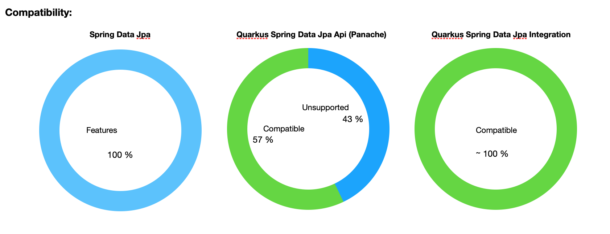
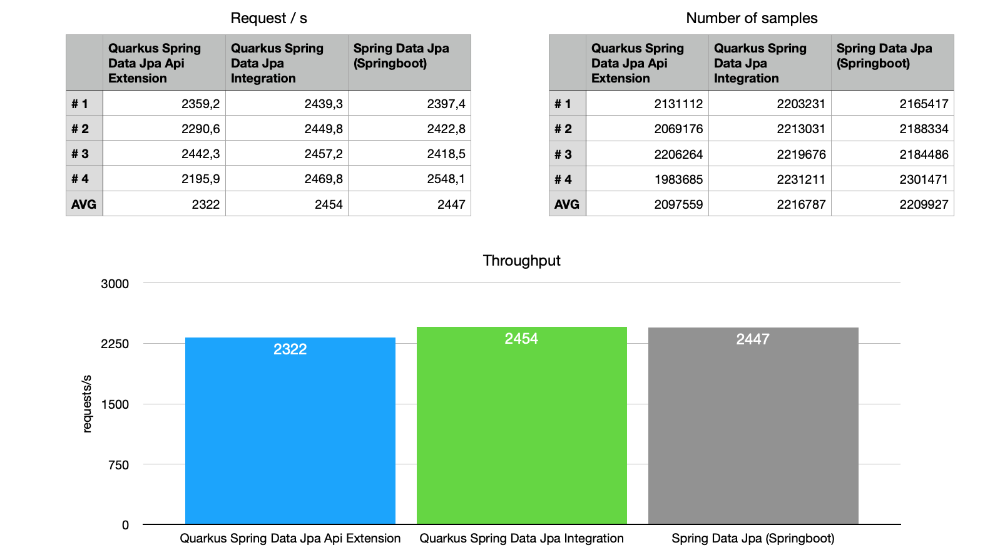
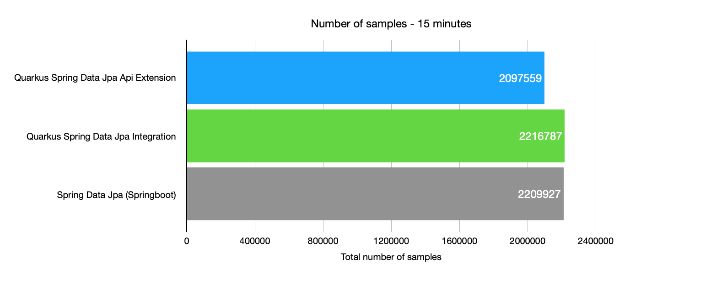
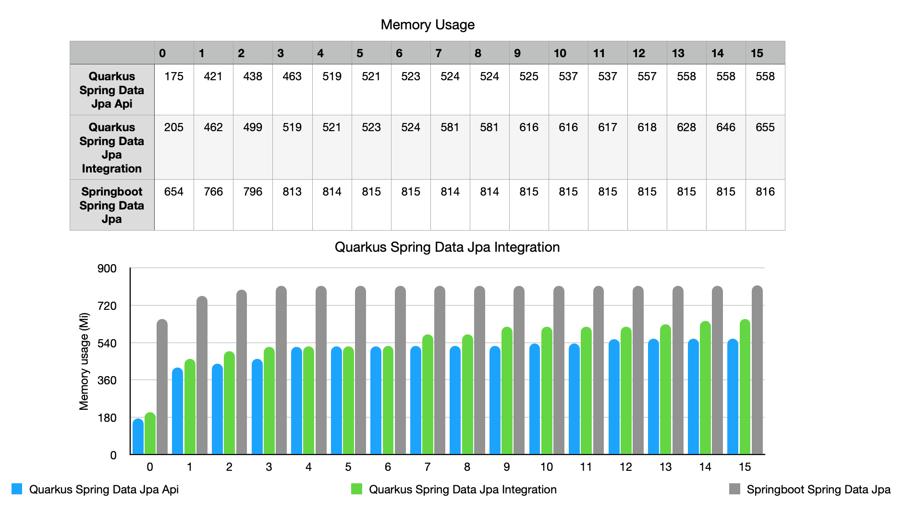

# quarkus-spring-data-jpa-integration extension

Quarkus extension that integrates Spring Data Jpa and provides all the features of this famous framework (No API / No Panache)! No more limits! Easy to migrate and run!
Migrate to Quarkus and enjoy a noticeable improvement in performance and memory consumption without losing any functionality!


## What is *Quarkus Spring Data Jpa Integration* ?

This is an extension that integrate Spring Data Jpa in Quarkus. It's intended to be a first step to migrate large projects or projects that uses features that are not supported by the current Panche Spring Data Jpa Api implementation.

The mission of this project is to allow not only an easy migration of projects based on Spring Boot / Spring Data Jpa, also allow to incorporate in this way other projects of the Spring Data stack in less time and in a simpler way to maintain.

## Provides the best compatibility



## Provides great performance





## Provides efficient use of memory



## Supported features

- [x] Support for default Spring data Repository interfaces:
  - [X] CrudRepository
  - [X] PagingAndSortingRepository
  - [X] JpaRepository
  - [X] JpaRepositoryImplementation
  - [X] SimpleJpaRepository
- [X] Query Methods
  - [X] Derived count query
  - [X] Derived delete query
  - [X] Derived update query
- [X] Native queries with @Query
- [X] Named queries with @Query
- [X] QueryByExampleExecutor
- [X] Custom Repository Interfaces
- [X] Repository Fragments
- [X] @Transactional support
- [X] Enhanced lookup of repository fragments hierarchy
- [X] @NoRepositoryBean support
- [X] Multi-Configuration
- [X] Property Expressions (transversal property)
- [X] Special Parameter Handling (Pageabla, Sort)
- [X] Limiting Query Results
- [X] Returning types (Collections / Iterables)
- [X] Returning type: Streamable
- [X] Optional (null handling)
- [X] Async query result (ava.util.concurrent.Future as return types)
- [X] Custom Configuration with MicroProfile Config (quarkus application.properties)
- [X] Custom Configuration with a given Cdi Repository Configuration Bean
- [X] Repository Custom Implementation (Impl)
- [X] Custom Base Repository
- [X] Projections (dtos)
- [X] Specifications
- [X] Persistable.isNew or EntityInformation.
- [X] QueryHints

## Features supported by "Quarkus Spring Data Jpa Integration" (not supported in Quarkus API implementation - Panache Spring Data Jpa Api -)

- [X] QueryByExampleExecutor
- [ ] QueryDSL support
- [X] Custom base Repository
- [X] java.util.concurrent.Future as return types
- [X] Native queries with @Query
- [X] Named queries with @Query
- [X] Persistable.isNew or EntityInformation.
- [X] QueryHints
- [X] Slice triggers a count query by every slice ([issue](https://github.com/quarkusio/quarkus/issues/9357))

## Not tested features 

- [ ] Spring Data Extensions
  - [ ] QueryDSL Extension
  - [ ] Repository Populator Extension

- [ ] Support for other Spring data Repository interfaces (less common): 
  - [ ] QuerydslJpaRepository (not tested. Deprecated in Spring Data Jpa)
  - [ ] ReactiveCrudRepository (not tested yet)
  - [ ] RevisionRepository (not tested yet)
  - [ ] RxJava2CrudRepository (not tested yet)
  - [ ] RxJava2SortingRepository (not tested yet)


## Known limitations and advantages

It is known that the way to generate code for the implementation of Panache (Spring Data Jpa API), surely is the optimal solution, however, when we are trying to migrate from a project with Spring Data Jpa to Quarkus, many of us have had to rewrite lot of code for some unsupported features or with slight differences to how the original solution works.

So this extension aims to allow you to take the first steps... to be able to jump to Quarkus in a simple way! It is literally possible to do it in a few minutes now!

While the performance tests are preliminary... it's amazing! its performance is equal to or greater than the current implementation of Panache's Spring Data Jpa Api but without relegating any feature offered by Spring Data Jpa! Quarkus with this extension provides an improvement of around 30% in memory consumption in relation to their respective Springboot version.


## Source code

In the root of the source code you can see the following projects and folders: 

 - quarkus-spring-data-jpa-extension-parent
   - runtime
   - deployment
 - samples
   - quarkus-spring-data-jpa-integration-demo (Quarkus + Quarkus Spring Data Jpa Integration)
   - quarkus-spring-data-jpa-api-demo (Quarkus + Quarkus Spring Data Jpa Api Extension - Panache Impl -)
   - spring-data-jpa-service (Springboot + Spring Data Jpa)
 
 
### quarkus-spring-data-jpa-extension

The source of the extension. It contains two modules: runtime and deployment like any other extension.
In the test folder of the deployment module you can find a complete TestSuite that cover more than 300 tests.

> **Test cases serve as an example of use and testing of almost all the functions offered.**


### samples

#### quarkus-spring-data-jpa-integration-demo

Demo project with Quarkus v1.6 and the new *Spring Data Jpa Integration* extension which allows to migrate all the services implemented in the SpringBoot project with almost no code changes! (only configuration related changes)!

> **Repositories been restricted to only those currently supported by Quarkus (SD Jpa Api) to perform load tests**


#### quarkus-spring-data-jpa-api-demo

Demo project with de default Quarkus v1.6 with the Spring Data Jpa Api provided by Quarkus. 

> **Repositories have been restricted to only those supported by this extension.**


#### spring-data-jpa-service

SpringBoot project with rest services using Spring Data Jpa.

> **Repositories have been restricted to only those currently supported by Quarkus (SD Jpa Api) to perform load tests**


## Related projects

[spring-data-commons for cdi](https://github.com/arielcarrera/spring-data-commons-cdi)
[spring-data-jpa for cdi](https://github.com/arielcarrera/spring-data-jpa-cdi)


## Maven Repositories

```
    <repositories>
        <repository>
            <id>github</id>
            <name>GitHub Ariel Carrera - Spring Data Commons Packages</name>
            <url>https://maven.pkg.github.com/arielcarrera/spring-data-commons-cdi</url>
        </repository>
        <repository>
          <id>github3</id>
          <name>GitHub Ariel Carrera - Quarkus Spring Data Integration Packages</name>
          <url>https://maven.pkg.github.com/arielcarrera/quarkus-spring-data-integration</url>
        </repository>
    </repositories>
```

### Video presentation

[click here (youtube)](https://www.youtube.com/watch?v=GY-4_kBU1AE)
